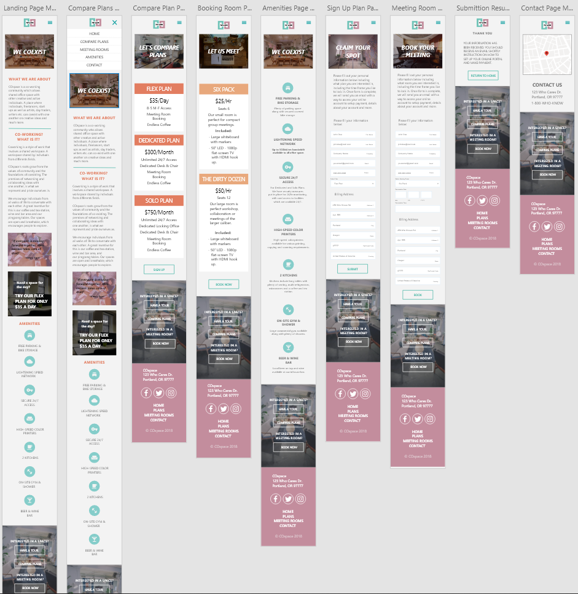
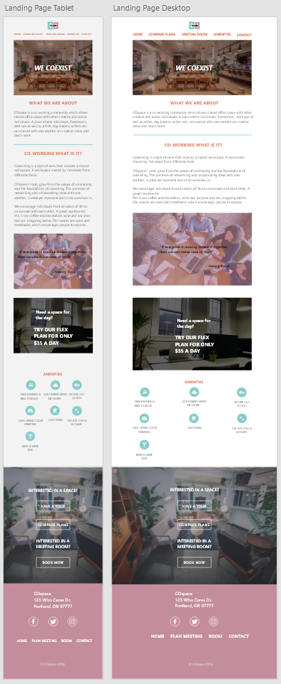

# _Co-working Startup Mockup and Design_

#### _A mockup and design for a co-working startup_

#### By _**Hassan Al-khalifah**_

## Description

_I was instructed to mockup/design and eventually build a website for a dummy new co-working startup who has established a space in town, which has been remodeled and ready to open soon. The scenario is, the client requires a website and I have been hired to design it and develop it._

### Wireframe Mockup Screen Shots

#### Mobile Wireframe Mockup



----

#### Tablet and Desktop Landing Page Wireframe Screenshot



### Target Users

* **Client**
  * **Needs:** A website that showcases their in-person presence with a online presence that includes photos of their space, a layout smooth and easy to navigate and that comes off hip, high-end, but with a feel that welcomes all people not exclusive to tech only. It needs to also include the amenities they offer. They need at least a landing page, contact page, page featuring amenities and a page detailing their subscription model, cost, membership and how to join.
  * **Pain points:** Are afraid that they and what they are will not be represented and presented correctly. Do not want to come off as another less local, corporate co-working space like WeWork and TechSpace. Do not want to be represented as only catering to the tech persona.
  * **How we can serve:** Craft website to be clean, open and easy to navigate which should showcase the environment the client has to offer. I will include bold and simple fonts to showcase focal and informative points. A picture says a thousand words, so I will include focus images of the clients space, which allows potential users to get a feel of the environment before they walk in. Information about the company will be easy to find and read. Additionally, I will use inspirations from other similar sites to get a feel of what the industry is presenting and try to include a feel that sticks to that, but represents the company still.

* **Developers and other personas**
  * **Needs:** Information about offered spaces, prices and a way to setup an appointment to tour and/or also book a space of interest. As well, what plans are offered, hours of operation, location and contact information and amenities offered.
  * **Pain points:** Not enough information, which result and having to call company for details that easily could have been represented on website.
  * **How we can serve:** Provide easy to navigate website that includes all relevant information based on category in a simple to read manner, but in minimal locations so user will not have to search around for it.

* **Other personas, i.e. artists, day-traders, craftspeople, writers, counselors etc.**
  * **Needs:** Information that entails a diversification of space and amenities offered.
  * **Pain points:** A website that is not informative enough to depict the type of users allowed to work in the offered spaces.
  * **How we can serve:** Provide examples and details of available spaces and past individuals who have used them. Include testimonials to encourage potential users.

### personas

* _As a client, I need our website to be informative, easy to navigate, not cluttered, a way for potential users to contact us _

* _As a potential user, I want a landing page that is easy to navigate, informative and not cluttered with overwhelming details._

* _As a potential user, I want information about plans and offered spaces in a central location. As well I need a way to set up appointments for viewing spaces and/or also book._

* _As a busy on the go potential user, I require a website that is viewable not only on computers, but can be viewed on tablets and cellphone, but informative and easy to navigate._

* _As a out of city, state or country potential user, I need information regarding location, a map of sorts and contact information._

* _As a non technical or business individual, but a potential user, I need information on what the offered spaces can be used for and testimonials from past users._

* _As a potential user, I would like to know about what amenities regarding parking, coffee, kitchens, internet speeds, etc_

## Setup/Installation Instructions

```
$ cd Desktop
```

```
$ git clone [remote repo name]
```

```
$ cd [remote repo name]
```

```
$ npm install
```

```
$ npm build
```

## Technologies Used

* _HTML5_

* _CSS3_

* _SASS_

* _JavaScript_

* _jQuery_

* _Adobe XD_

* _Git_

* _GitHub_

* _README_

### License

Copyright (c) 2018 **_Hassan Al-khalifah_**
